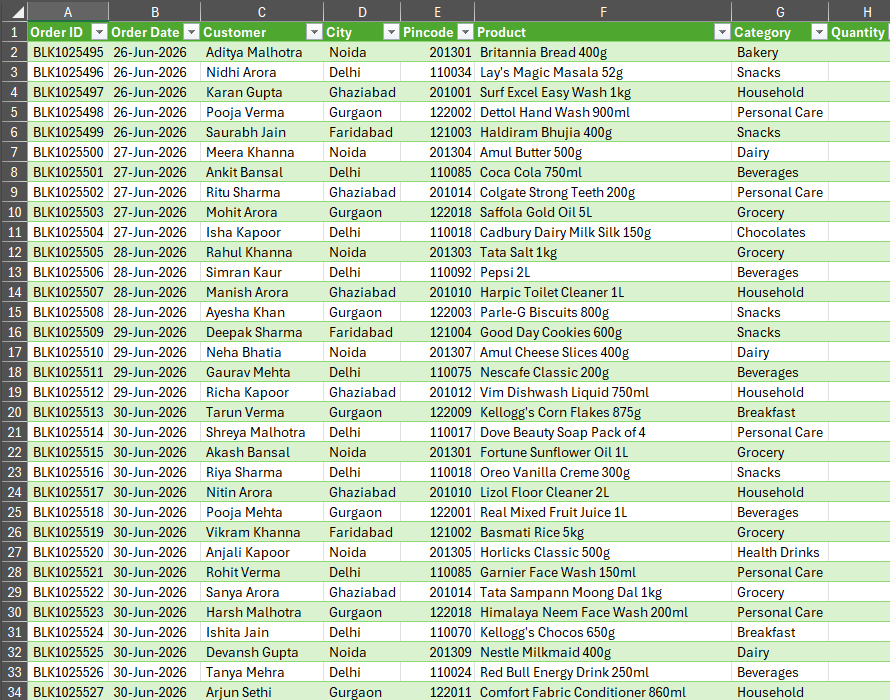

# Blinkit Orders Data Cleaning & Analysis

## 📌 Project Overview

This project focuses on cleaning, organizing, and analyzing Blinkit orders data using **Microsoft Excel and Power Query**.

The dataset was initially unorganized, so I first cleaned and properly structured the data using Power Query. After that, the cleaned dataset was imported into Excel and analyzed using Pivot Tables.

Finally, I created a Bar Chart to identify the **Top 3 Cities by Sales**.

---

## 🛠️ Tools Used

- Microsoft Excel
- Power Query
- Pivot Table
- Bar Chart
- Data Cleaning & Transformation

---

## 🔄 Project Workflow

### Step 1: Raw Data

The project started with a raw Blinkit orders dataset.

The data was initially unorganized and required cleaning and proper arrangement before analysis.

---

### Step 2: Data Cleaning & Arrangement Using Power Query

I used **Power Query** to clean and organize the raw dataset.

The main purpose of this step was to transform the unorganized data into a structured format that could be easily analyzed.

The cleaning and transformation process included:

- Organizing the dataset
- Cleaning the raw data
- Arranging the data properly
- Standardizing the data structure
- Preparing the dataset for analysis

---

### Step 3: Import Cleaned Data into Excel

After completing the cleaning and transformation process in Power Query, the final structured dataset was imported into Microsoft Excel.

This made the cleaned data ready for further analysis.

---

### Step 4: Pivot Table Analysis

I created a **Pivot Table** in Excel to summarize and analyze the cleaned Blinkit orders data.

Using the Pivot Table, I analyzed sales performance across different cities.

---

### Step 5: Top 3 Cities by Sales

Based on the Pivot Table analysis, I created a **Bar Chart** to visualize the Top 3 Cities by Sales.

The chart makes it easier to compare the sales performance of the leading cities.

---

## 📊 Key Analysis

The final analysis focuses on:

- Identifying the **Top 3 Cities by Sales**
- Comparing sales performance between cities
- Presenting the results using a Bar Chart
- Converting raw data into meaningful business insights

---

## 📁 Project Files

| File | Description |
|------|-------------|
| `Blinkit dataset cleaned and find final result.xlsx` | Excel workbook containing the cleaned dataset and final analysis |
| `Raw Data Blinkit orders.png` | Screenshot of the raw/unorganized dataset |
| `Cleaning.png` | Screenshot of the Power Query cleaning and arrangement process |
| `Final result.png` | Screenshot of the final analysis and Top 3 Cities by Sales chart |

---

## 🎯 Project Objective

The objective of this project was to demonstrate how raw and unorganized business data can be:

**Raw Data → Clean & Organize → Import into Excel → Pivot Table → Visualization → Business Insight**

This project demonstrates practical skills in **Power Query, Excel Data Cleaning, Pivot Tables, and Data Visualization**.

---

## 👨‍💻 Project By

**Upendra Yadav**

Data Analyst | Excel | Power BI | SQL | Python
